这里存放了 *Understanding Molecular Simulation: From Algorithms to Applications* 这本书的全部 16 个程序设计练习。由于源文件是使用 Fixed Format 的 Fortran 77 格式，在这里先将其转为 Fortran 90 格式再进行相应模块编写。阅读说明：

1. 设题号为 `<n>`，题目中如果有未完成的代码，则用 `<n>_0.f90` 命名，已完成的代码用 `<n>.f90` 命名，输出文件用 `<n>.dat` 命名。
2. 如果题目中有不止一个需要运行的程序，则用 `<n>_<i>.f90` 命名，`<i>` 是序号数，相应的输出文件用 `<n>_<i>.dat` 命名。
3. 如果题目中有作图题，这里使用 Python 的 `matplotlib` 库进行作图，处理 `<n>_<i>.dat` 作图的程序命名为 `<n>_<i>.py`，生成的图片命名为 `<n>_<i>.png`。

完成情况：

| 题号 | 情况   |
| ---- | ------ |
| 1    | 完成   |
| 2    | 完成   |
| 3    | 完成   |
| 4    | 完成   |
| 5    | 存疑   |
| 6    | 完成   |
| 7    | 完成   |
| 8    | 完成   |
| 9    | 存疑   |
| 10   | 完成   |
| 11   | 完成   |
| 12   | 完成   |
| 13   | 存疑   |
| 14   | 未完成 |
| 15   | 未完成 |
| 16   | 未完成 |

# Exercise 1（Distribution of Particles, Chpt 02）

## 2

$n$ 球放入 $p$ 盒子，有一个盒子为空的概率大约是

$$
p\times \frac{(p-1)^n}{p^n}
$$

不过精确的值也不太会算……

## 3

见 `1.dat`。要证明这个分布对小的 $n_1/N$ 是 Gaussian 的，就是要证明

$$
P(n_1)\approx P(0)e^{-An_1^2}
$$

其中 $A$ 是待定系数。为此我们计算两者的比值：

$$
\frac{P(n_1)}{P(0)}=\frac{(N/2)!(N/2)!}{(N/2-n_1)!(N/2+n_1)!}
$$

现在将阶乘用 Stirling 公式展开，注意到 $\sqrt{2\pi}$ 和 $e^{-x}$ 项都抵消了，所以

$$
=\frac{(N/2)^{N+1}}{(N/2-n_1)^{N/2-n_1+1/2}(N/2+n_1)^{N/2+n_1+1/2}}
$$

再取对数，

$$
\ln(\cdot)=(N+1)\ln\frac N2-\left(\frac N2-n_1+\frac12\right)\ln\left(\frac N2-n_1\right)-\left(\frac N2+n_1+\frac12\right)\ln\left(\frac N2+n_1\right)
$$

对上式中的 $\ln$ 函数在 $N/2$ 处展开并保留到一阶，得到
$$
=\left(\frac N2-n_1+\frac 12\right)\times-\frac{2n_1}N+\left(\frac N2+n_1+\frac 12\right)\times\frac{2n_1}N=\frac{4n_1^2}N
$$
这样我们就证明了它是 Gaussian 的。

# Exercise 2（Boltzmann Distribution, Chpt 2）

## 1

当温度很高时，这些能级上近似于均匀分布。

## 2

在温度相同时，相比于（1）中分布向高能级偏移。

## 3

输入温度使近似公式中 $q=10$，计算出 $q=10.34$。

# Exercise 3（Coupled Harmonic Oscillators, Chpt 2）

## 1

经过比较，我觉得本书作者写的算法是辣鸡。

## 2

画张好图居然要 1 亿个循环……我们保持平均能量是 10，每次增加 3 个谐振子：


可见随谐振子数量升高，趋于 Boltzmann 分布（这里采取平均能量为 10 时的等效温度 0.09531）。这样，其他的谐振子充当的就是热浴作用。

## 3

按 0.09531 进行恒温模拟，与上面类似。


## 4

联系是显然的。系统（一个谐振子）能量越高，环境（NVE 系综中其他谐振子）能量越低，环境简并度越低，因此处于这样的状态概率越小。这与通过微正则系综推导正则系综的过程完全一致。

# Exercise 4（Random Walk on a 1D Lattice, Chpt 2）

这个程序的写法也太反人类了！

## 1

不妨假设 N 是偶数。则 n 也是偶数，达到 n 需要经过 $(N+n)/2$ 次向右移动和 $(N-n)/2$ 次向左移动。这样的概率由组合数给出：
$$
\ln P(n,N)=\ln \frac1{2^N}\binom{N}{(N+n)/2}
$$
用 Stirling 公式化简：
$$
=-N\ln 2+\ln\frac{N^{N+1/2}}{\sqrt{2\pi}((N+n)/2)^{(N+n)/2+1/2}+((N-n)/2)^{(N-n)/2+1/2}}
$$
化简过程和上面某题类似，最后得到
$$
\frac12\ln\left(\frac2{\pi N}\right)-\frac{n^2}{2N}
$$

## 2

均方位移就是分布函数的方差 $N$，时间也是 $N$，所以扩散率 $D=1/2$。根据琴生不等式，采样比较少的时候会有负偏差。


## 3

由于产生了向一侧移动的倾向，扩散率显著提高，而且随 N 呈二次函数变化：


# Exercise 5（Random Walk on a 2D Lattice, Chpt 2）

## 1

就是 $\theta=N/M^2$

## 2


橙线是 $0.25(1-\theta)$，蓝线是实验结果。

在浓度低时，移动的接受率正比于空位的数量，所以呈线性关系。

## 3

见 `5_2.dat`，例如增加向下移动的概率而均匀减小其他三个的概率，则 $x$ 方向的迁移率减小，$y$ 方向增大。

## 4

迁移率只跟绝对位移有关系所以好像没影响？？？

# Exercise 6（Calculation of $\pi$, Chpt 3）

## 1

不失一般地，我们认为 $d=2$，则在 $l\times l$ 的正方形中投点，如果满足 $x^2+y^2<1$ 就计数。

## 3

$\pi$ 的估计值 $\pi^*$ 由下式给出：
$$
\pi^*=\frac{l^2}{N}\sum_i\mathbb I(x_i^2+y_i^2<1)
$$
其中 $\mathbb I$ 是指示函数，这个指示函数的期望是 $\pi/l^2$。因此方差为
$$
\begin{aligned}
\sigma^2&=\left(\frac{l^2}{N}\right)^2\sum_i\left\langle \left(\mathbb I(x_i^2+y_i^2<1)-\frac{\pi}{l^2}\right)^2\right\rangle\\
&=\frac{\pi(l^2-\pi)}{N}
\end{aligned}
$$
所以应该让边长比较小。

## 4

废话……

# Exercise 7（The Photon Gas, Chpt 3）

## 1

是符合的。$0\to 1$ 的概率是 $0.5\times e^{-\beta}$，而 $1\to 0$ 的概率是 $0.5$。

## 2

1. 是正确的。假设 $i<j$，那么 $i\to j$ 的概率是 $0.909\times e^{-\beta(j-i)}$，$j\to i$ 的概率是 $0.909$。
2. 不正确。只能生成那些模 3 同余的态。

## 3

见 `7_1.f90`，与理论结果符合很好。

## 4

在 `7_1.f90` 给出的结果大约有 0.01 的误差的情况下，`7_2.f90` 的误差在 0.5 左右。显然这种做法违反了细致平衡原理。

特别是 $\beta \gg 1$ 时，可以证明 `7_2.f90` 给出的能量将精确地为 0.5，而实际能量 $\to 0$，所以此时（相对）误差最大。

## 5

统计前 100 能级的频数，并按 0 能级的归一化。与解析结果符合很好（精确到小数点后 3 位）。

# Exercise 8（Monte Carlo Simulation of a Lennard-Jones System）

## 1

$$
\mathrm{vir}=\sum_{i<j}\left(\frac{48}{r_{ij}^{12}}-\frac{24}{r_{ij}^6}\right)
$$

## 2


## 3

懒得整

## 4

$$
C_V=\beta^2(\langle E^2\rangle-\langle E\rangle^2)
$$

## 5

假设 $\Delta U$ 关于位移是线性的， 那么要求
$$
e^{-\beta \langle\Delta U\rangle}=\frac12
$$
N 粒子同时移动，$\Delta U=\ln 2/N\beta$。

## 6

不能。均方位移只与温度有关，而与位移分布的具体形式有关。（Gaussian 分布的接受度会比较大，但这些接受的都是比较小的位移。）

# Exercise 9（Scaling as a Monte Carlo Move, Chpt 3）

## 1

由于 Boltzmann 因子在 $[0,1]$ 之间是常数，这要求当 $0<x_1<x_2<1$ 时：
$$
\alpha(x_1\to x_2)\mathrm{acc}(x_1\to x_2)=\alpha(x_2\to x_1)\mathrm{acc}(x_2\to x_1)
$$

### 位移

不妨设 $|x_1-x_2|<\delta$。此时 $\alpha(x_1\to x_2)=\alpha(x_2\to x_1)=1/2\delta$ （用概率密度衡量）。因此 $\mathrm{acc}$ 可以均取为 1。

### 标度

不妨设 $x_2<(1+\delta)x_1,x_1>x_2/(1+\delta)$。此时，
$$
\alpha(x_1\to x_2)=\lim_{\Delta x\to 0}\frac{1}{\Delta x}\left[\frac{x_2+\Delta x}{x_1}-\frac{x_2}{x_1}\right]=\frac1{x_1}
$$

$$
\alpha(x_2\to x_1)=\lim_{\Delta x\to 0}\frac1{\Delta x}\left[\frac{x_2}{x_1-\Delta x}-\frac{x_2}{x_1}\right]=\frac{x_2}{x_1^2}
$$

可见概率密度是不等的。所以应设 $\mathrm{acc}(x_1\to x_2)=x_2/x_1$。

## 2

见 `9.dat`，对两种移动方式都成功生成了 $[0,1]$ 上的均匀分布。

## 3

由于 $\alpha(x_2\to x_1)$ 更大些，会向 0 的邻域集中。

# Exercise 10（Molecular Dynamics of a Lennard-Jones System, Chpt 4）

## 1

【脏话】

## 2

在 `ninit` 步数之内，每次计算动能并与理论值 $1.5NT$ 比较，并调整动能的大小。

## 3

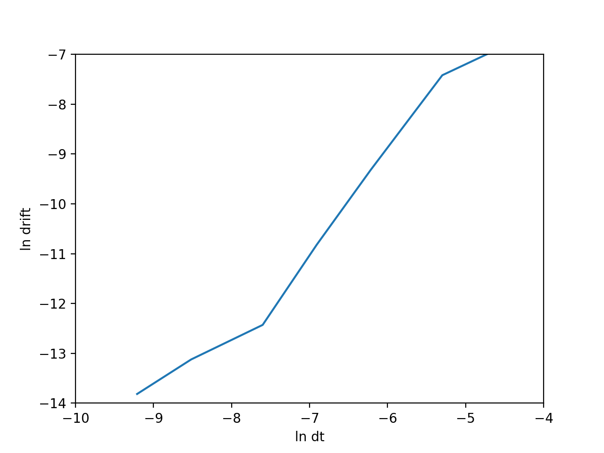

按作者的参数，这个 drift 本身的波动就很大，所以数据不大可信……

保持 $\Delta t=5\times 10^{-4}$，将温度提高 10 倍，drift 也提高约一个数量级；

保持 $\Delta t=5\times 10^{-4}$，将盒子缩小一倍，drift 也提高了一个数量级。

## 4

按题意我们抽象为这样的数学问题：一个 $[-a,a]$ 之间的数，如果小于 $-a/2$ 就加 $a$，大于 $a/2$ 就减 $a$。要比较以下三种算法的速度：

### 流程法

```fortran
if (dx > hbox) then
	dx = dx - box
else if (dx < -hbox) then
	dx = dx + box
end if
```

### `nint` 取整法

```fortran
dx = dx - box * nint(x * ibox)
```

### `int` 取整法

```fortran
nint(x) = int(x + 1000.5) - 1000
```

另外我自己觉得 `floor` 取整法应该也挺快……

### `floor/ceiling` 取整法

```fortran
nint(x) = floor(x + 5d-1)
nint(x) = ceiling(x - 5d-1)
```

为此我们单独写一个测试程序，输出结果为：

```fortran
流程控制法用时：  0.26966200000000001     
nint 取整法用时：  0.27985999999999994     
int 取整法用时：  0.23286499999999999     
floor 取整法用时：  0.25770499999999996
```

还是 `int` 比较🐂️🍺️。

## 5

这是个乘法快还是除法快的问题。类似验证可得乘法比除法快 10%。

## 6

速度自关联函数方法得到了 0.0078，均方位移方法得到了 0.0075，尽管它们没有真正意义上收敛，但结果确实差不多。

在应用周期性边界条件时，需要注意必须使用「未放回盒子中」的位移，而不是实际的位移。

D 的量纲是 $L^2T^{-1}$，SI 单位是 $\mathrm{m^2s^{-1}}$，考虑到原子单位制定义了 $\varepsilon=\sigma=m=k=1$，所以它的单位是 $\sigma^2\sqrt{\varepsilon/m\sigma^2}$。

## 7

给定模拟条件 $T=0.8$，$p=0.45$，等式右侧为 $-1.28$，而扩散速度为 $0.057$，取对数 $-1.24$。精度还行……

## 8

$$
U=2\pi\rho N\int_0^{+\infty}r^2u(r)g(r)\mathrm dr
$$

回到 $T=1.5$ 的情况下模拟，得到用这种方法计算出来的势能是 $-486$，而此前计算的是 $-448$，可见有一定的误差，误差可能来自于周期性边界条件（具体计算时只能积分到盒子边界）。

## 9

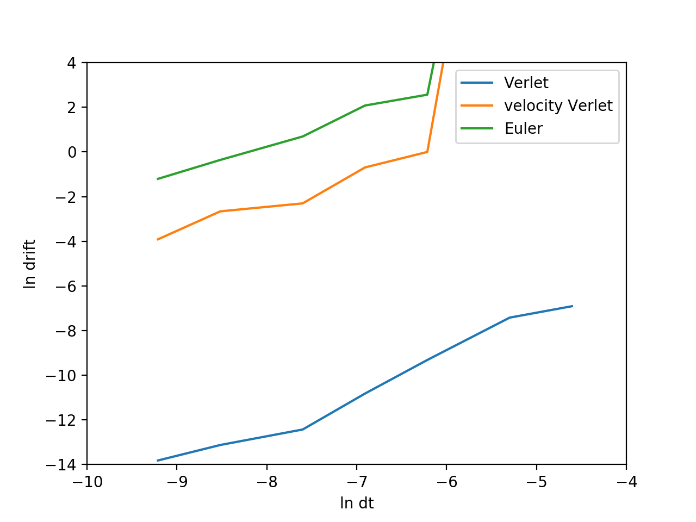

相较而言，velocity Verlet 算法不是时间可逆的，因此差于 Verlet 算法。Euler 算法更差。

# Exercise 11（Monte Carlo in $NPT$ Ensemble, Chpt 5）

## 1

势函数不可导。

## 2

当然是一样的。

## 3

$\ln V$：

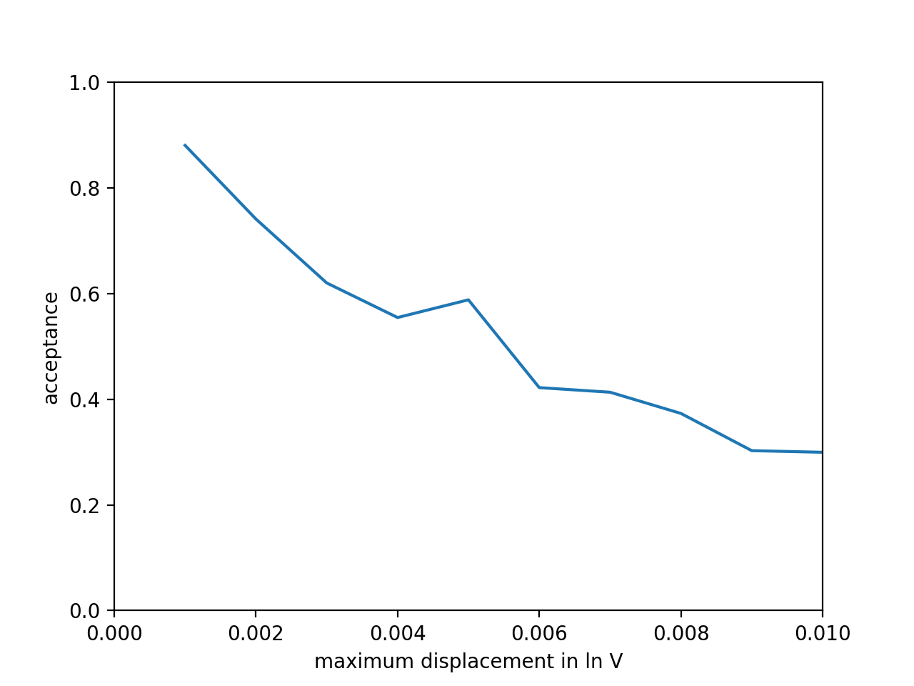

$V$：

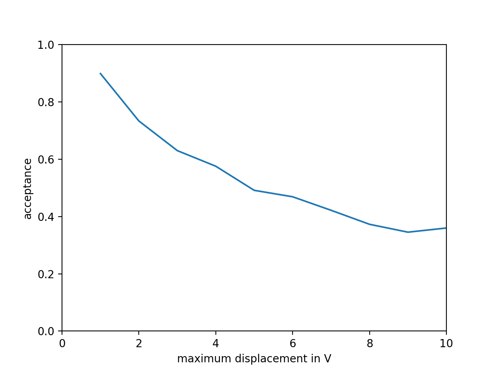


# Exercise 12（Ising Model, Chpt 5）

## 2

$\beta>\beta _c$，对称性自发破缺，因此只要初始状态下有随机的扰动，就会向一侧偏离，得到全部在 $M>0$  或 $M<0$ 分布的结果。

## 3

$$
\langle O\rangle=\frac{\int O(\mathbf x)e^{-\beta U(\mathbf x)}\mathrm d\mathbf x}{\int e^{-\beta U(\mathbf x)}\mathrm d\mathbf x}=\frac{\int O(\mathbf x)e^{-\beta W(M)}\pi\mathrm d\mathbf x}{\int e^{-\beta W(M)}\pi\mathrm d\mathbf x}=\frac{\langle Oe^{-W}\rangle_\pi}{\langle e^{-W}\rangle_\pi}
$$

## 4

仍然不对称，但对称性变得好一些了（至少正负都有）。

效率取决于 $\langle O\rangle$ 方差，所以应该是
$$
\min_{W}\sigma^2
$$

## 5

## 6

此时 $\pi=1$，回归到正常的 MC。

# Exercise 13（Barrier Crossing, Chpt 6）

## 1

$$
U''(x)=\begin{cases}
2\varepsilon B&x<0\\
4\pi^2\varepsilon \cos(2\pi x)&0\le x\le 1\\
2\varepsilon B
\end{cases}
$$

由此可见 $4\pi^2\varepsilon=2B\varepsilon$，因此 $B=2\pi^2$。

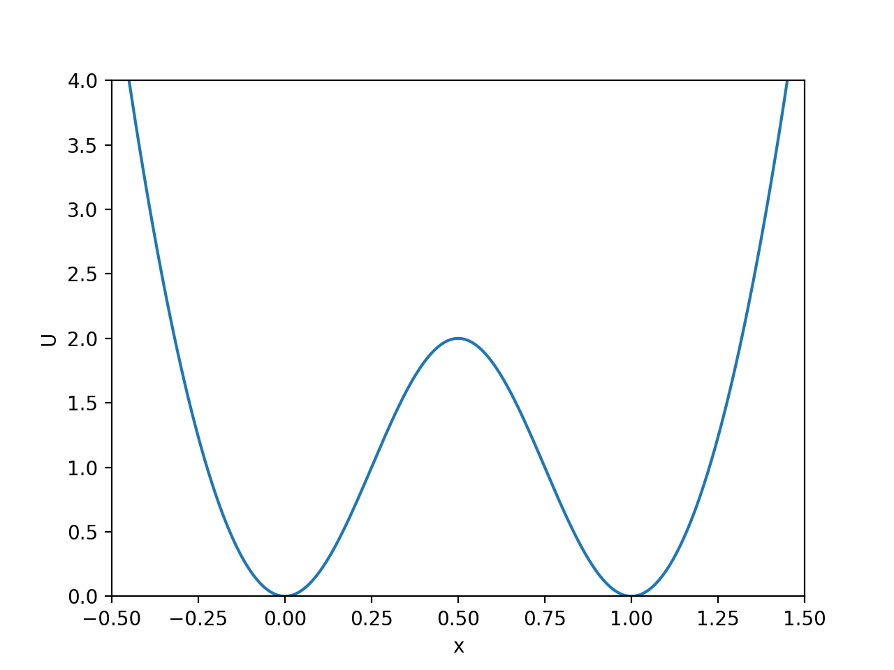

## 2

### NVE

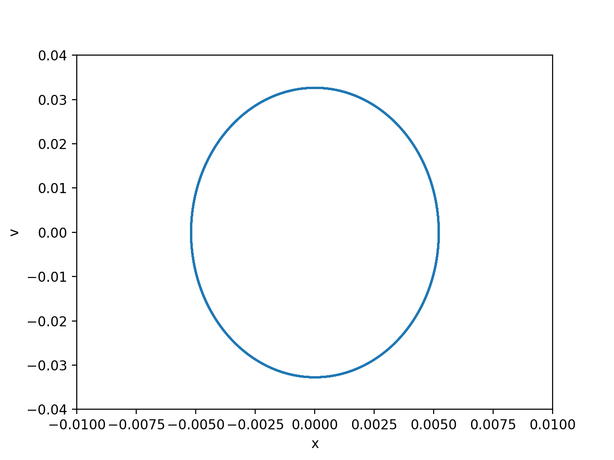

因为温度低时初始速度很小，只能进到 $x$ 比较小的地方，在这个区域内近似于谐振子势，故为椭圆形。

### MC

比较四种方法的 $x$ 分布曲线：MC 为中间多两边少，而其余为中间少两边多（到某一位置截止）。这是因为分子动力学模拟中粒子会在速度低的区域被采样到的概率更大。

### Andersen / Nosé-Hoover

Anderson:

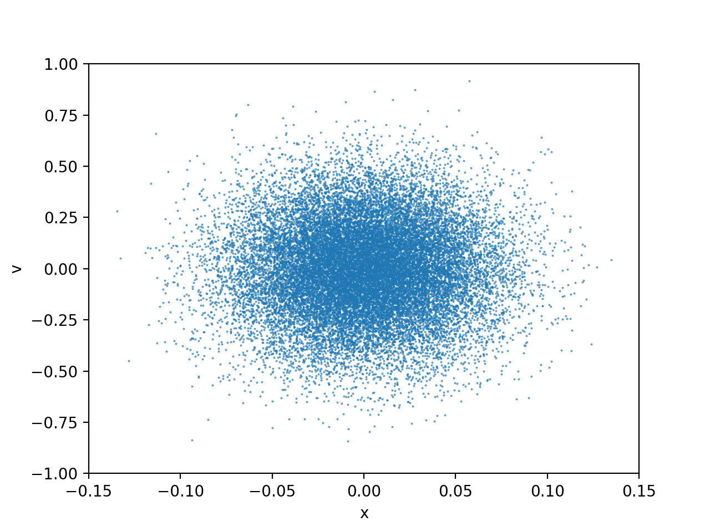

NHC:

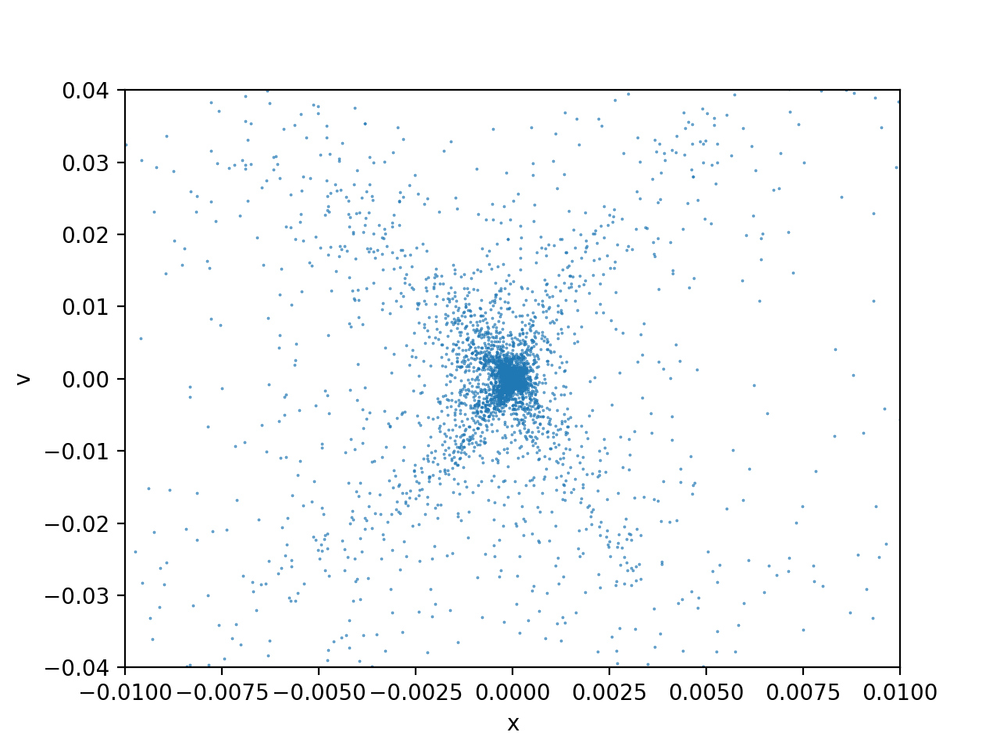

看起来 NHC 方法短期内效率比较低。

## 3

以 Andersen 方法为例：

$T=0.18$ 时：

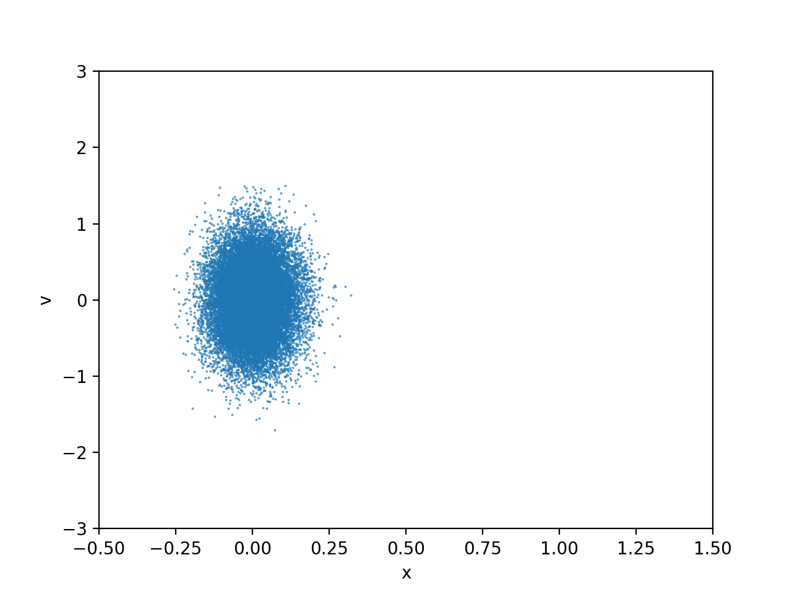

$T=0.19$ 时：

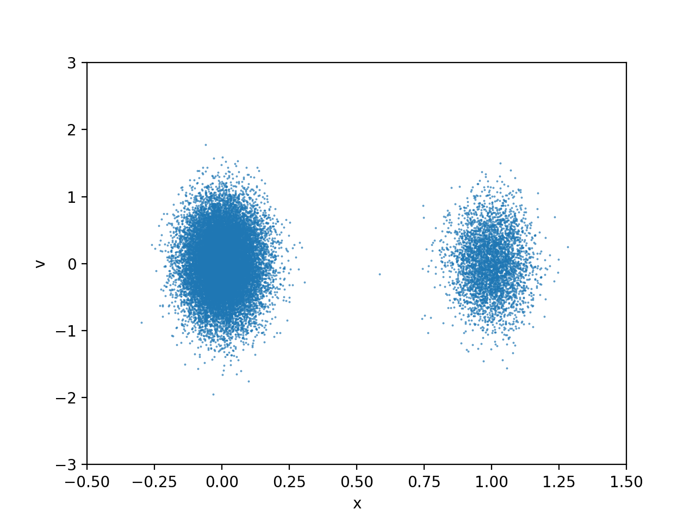

$T=0.20$ 时：

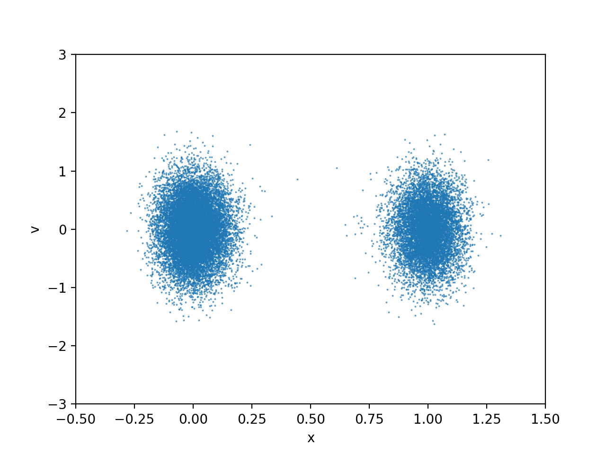

$T=0.50$ 时：

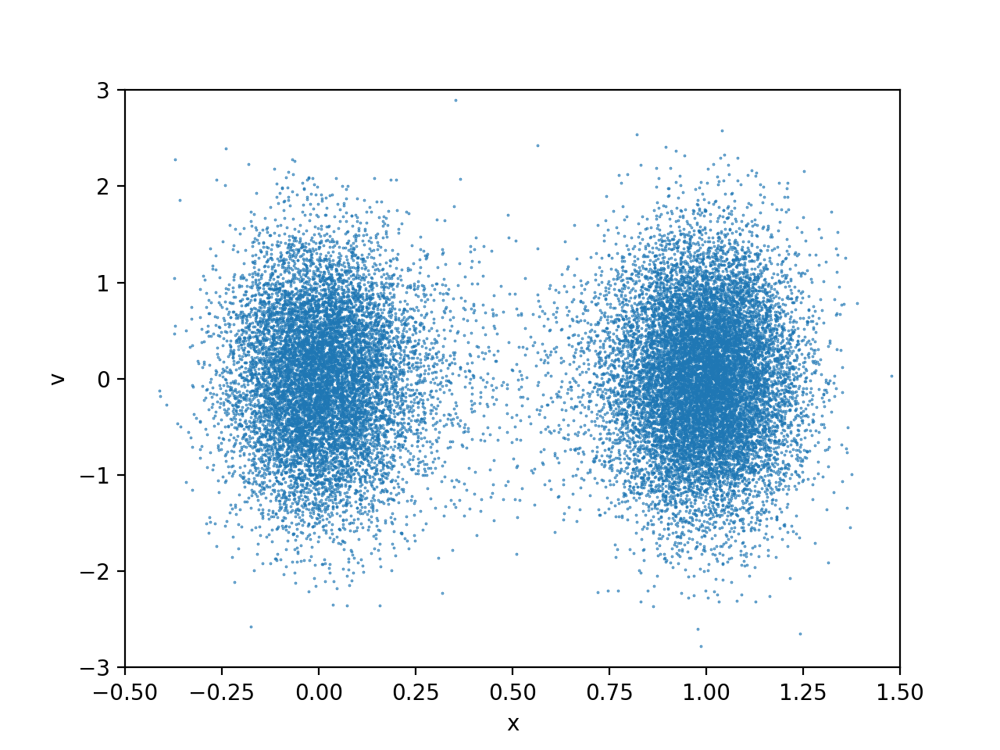

## 4

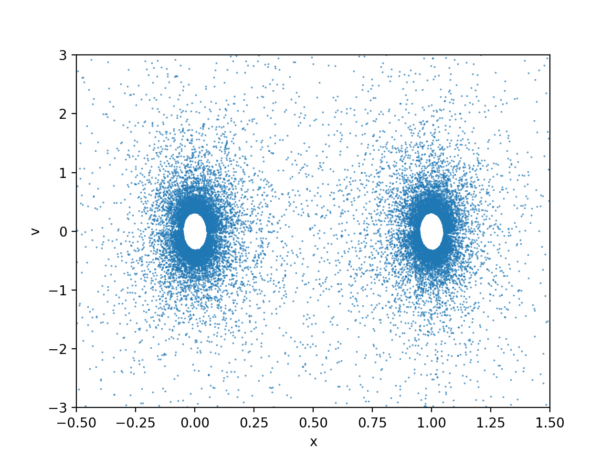

现在要看这是不是正则分布。比较遗憾的是，这个离正则分布差得有点远……

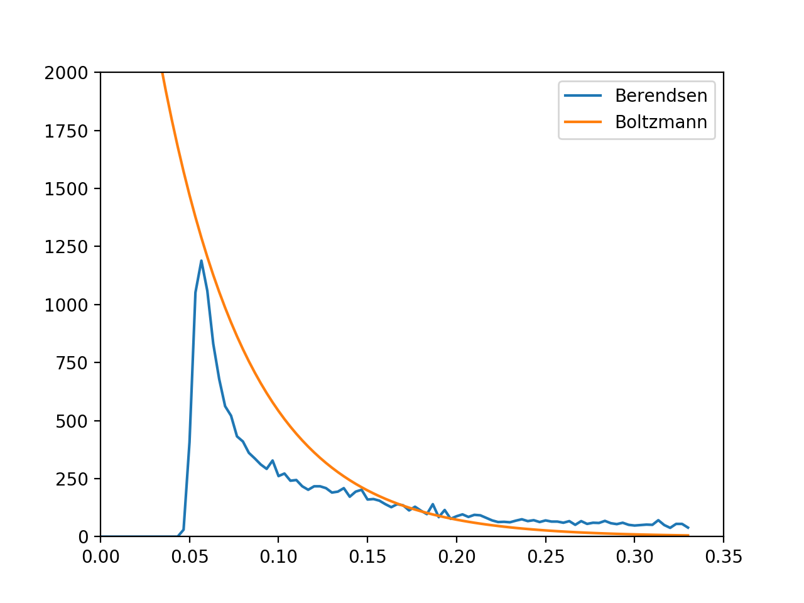

不过要说能不能用的话，我觉得还是能用的吧……

## 5

显然，如果温度过低，将无法越过势垒，造成很低的（非真实的）扩散系数。

对于 Anderson 控温方案来说，碰撞频率增加将使得速度的解关联增强，而扩散系数是关于速度自关联函数的积分，也会受到影响。所以这里我们用 Nosé-Hoover 方案来控温。

具体的扩散系数计算目前还没有取得令人信服的结果……

# Exercise 14（Vapor-Liquid Equilibrium, Chpt 8）

# Exercise 15（CBMC of a Single Chain, Chpt 13）

# Exercise 16（CBMC of a Simple System, Chpt 13）