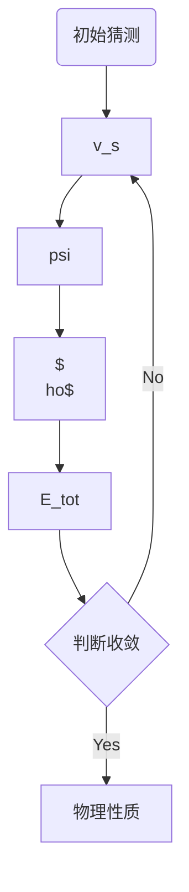

\chapter{密度泛函方法}

# 泛函的数学基础

## 泛函的定义

泛函：把一个函数映射到一个数，例
$$
I[f(x)]=\int_a^b f(x)\mathrm dx
$$
例：作用量是广义坐标轨迹的泛函，能量是波函数的泛函。

## 泛函微分

给定泛函，对函数引入一个微扰 $f\to f+\delta f$，求泛函的变化 $F[f+\delta f]-F[f]$，展开使得 $\delta F$ 可以表为：
$$
\delta F=\int\frac{\delta F}{\delta f(x)}\delta f(x)\mathrm dx+O(\delta f^2)
$$

此时 $\delta F/\delta f$ 就是 F 对 f 的微分。

## 例：经典 Columb 势泛函

$$
E_{H}[\rho]=\frac{1}{2} \iint \frac{\rho(\mathbf{r}) \rho\left(\mathbf{r}^{\prime}\right)}{\left|\mathbf{r}-\mathbf{r}^{\prime}\right|}\mathrm d \mathbf{r}\mathrm d \mathbf{r}^{\prime}
$$

它的微分表示为：
$$
\frac{\delta E_{H}[\rho]}{\delta \rho(\mathbf{r})}=\int \frac{\rho\left(\mathbf{r}^{\prime}\right)}{\left|\mathbf{r}-\mathbf{r}^{\prime}\right|}\mathrm d \mathbf{r}^{\prime} \equiv V_{\mathrm{H}}(\mathbf{r})
$$
这就是 Hartree 势。

## 例：Weiz Sacker 动能泛函

$$
T_{\mathrm{w}}[\rho(\mathbf{r})]=\frac{1}{8} \int \frac{\nabla \rho(\mathbf{r}) \cdot \nabla \rho(\mathbf{r})}{\rho(\mathbf{r})} \mathrm d \mathbf{r}
$$

它的微分表示为：
$$
\frac{\delta T_w[\rho]}{\delta\rho(\mathbf r)}=\frac18\frac{|\nabla\rho(\mathbf r)|^2}{\rho^2(\mathbf r)}-\frac14\frac{\nabla^2\rho(\mathbf r)}{\rho(\mathbf r)}
$$

## 泛函微分的链式规则

$$
F=F\left[f\left(x ;\left[g\left(x^{\prime}\right)\right]\right)\right]
$$

$$
\frac{\delta F}{\delta g(x)}=\int \frac{\delta F}{\delta f\left(x^{\prime}\right)} \frac{\delta f\left(x^{\prime}\right)}{\partial g(x)} d x^{\prime}
$$

## 一般形式的泛函微分计算规则

$$
F[\rho] \equiv \int f\left(\rho, \rho^{(1)}, \rho^{(2)}, \cdots, \rho^{(n)}\right) d x
$$

$$
\begin{aligned} \frac{\delta F[\rho]}{\delta \rho(x)}=& \frac{\partial f}{\partial \rho(x)}-\frac{\mathrm d}{\mathrm d x} \frac{\partial f}{\partial \rho^{(1)}(x)}+\frac{\mathrm d^{2}}{\mathrm d x^{2}} \frac{\partial f}{\partial \rho^{(2)}(x)} \\ &-\cdots \cdots+(-1)^{n} \frac{\mathrm d^{n}}{\mathrm d x^{n}} \frac{\partial f}{\partial \rho^{(n)}(x)} \end{aligned}
$$

联想 Euler-Lagrange 方程。

## Euler-Lagrange 方程

$F[f(\mathbf r)]$ 作为泛函在 $f_0$ 处取极值，则任意微扰造成的变化
$$
\int \frac{\delta F}{\delta f}\bigg|_{f=f_0}\delta f(\mathbf r)\mathrm d^3\mathbf r=0
$$
由变分引理，上式等价于要求
$$
\frac{\delta F}{\delta f}\bigg|_{f=f_0}
$$
为了保证给出的是极小值，还需要二阶变分大于 0。

## Lagrange 不定乘子法

在约束条件下取极值
$$
F_0=\min _{\{f(\mathbf{r})| G[f]=0\}} F[f(\mathbf{r})]
$$
约束表达为
$$
G[f]=0
$$
引入辅助泛函：
$$
L[f]=F[f]-\lambda G[f]
$$
并要求
$$
\frac{\delta L}{\delta f}=0
$$
当约束条件是空间局域性的时候，即
$$
g([f];\mathbf r)=0
$$
则此时 Lagrange 乘子应该是空间坐标的函数，辅助泛函是
$$
\Omega[f]=F[f]-\int\lambda(\mathbf r)g([f];\mathbf r)\mathrm d^3\mathbf r
$$

## 实例：Thomas-Fermi 近似

关于多电子体系密度泛函理论的一个最简单的近似：
$$
\begin{aligned}
E_{\mathrm{TF}}[\rho(\mathbf{r})]&=C_{\mathrm{TF}} \int(\rho(\mathbf{r}))^{5 / 3} \mathrm d \mathbf{r}+\int \rho(\mathbf{r}) V_{\mathrm{ext}}(\mathbf{r}) \mathrm d \mathbf{r}
\\
&+\frac{1}{2} \iint \frac{\rho(\mathbf{r}) \rho\left(\mathbf{r}^{\prime}\right)}{\left|\mathbf{r}-\mathbf{r}^{\prime}\right|}\mathrm d \mathbf{r}\mathrm d \mathbf{r}^{\prime}
\end{aligned}
$$

对应的辅助泛函
$$
\Omega[\rho(\mathbf{r})] \equiv E_{\mathrm{TF}}[\rho(\mathbf{r})]-\mu\left(\int \rho(\mathbf{r}) d^{3} r-N\right)
$$
变分原理：
$$
\frac{\delta \Omega}{\delta \rho(\mathbf{r})}=0 \Rightarrow \frac{\delta E_{\mathrm{TF}}[\rho]}{\delta \rho(\mathbf{r})}-\mu=0
$$

也即
$$
\frac{5}{3}C_{\mathrm{TF}}\rho(\mathbf r)^{2/3}+V(\mathbf r,[\rho])=\mu
$$
这即是 Thomas-Fermi-Dirac 方程，乘子具有化学势的意义。迭代求解格式：
$$
\rho^{(i+1)}=\left[(\mu^{(i)}-V^{(i)})\times\frac 3{5C}\right]^{3/2}
$$

$$
\mu^{(i)}=\frac1NE_{\mathrm{TF}}[\rho^{(i)}]
$$

## 电子密度与电子密度算符

$$
\rho\left(\mathbf{r}_{1}\right) \equiv N \int \left|\Psi\left(\mathbf{x}_{1}, \mathbf{x}_{2}, \cdots, \mathbf{x}_{N}\right)\right|^{2} \mathrm d s_{1} \mathrm d \mathbf{x}_{2} \cdots \mathrm d \mathbf{x}_{N}
$$

上式也可以通过电子密度算符表出：
$$
\hat\rho(\mathbf r)=\sum_{i=1}^N\delta(\mathbf r_i-\mathbf r)
$$

$$
\rho(\mathbf r)=\langle\Psi|\rho(\mathbf r)|\Psi\rangle
$$

满足一个奇点条件：
$$
\lim _{r_{i A} \rightarrow 0}\left[\frac{1}{2 \rho(\mathbf{r})} \frac{\partial}{\partial \boldsymbol{r}} \overline{\rho}(\mathbf{r})\right]=-\boldsymbol{Z}_{A}
$$

# Hohenberg-Kohn 定理

## H-K 第一定理

v-可表示性电子密度：对应于某个局域外势场下 N-电子体系的电子密度。

N-可表示性电子密度：对应于 N-电子（交换反对称）波函数的电子密度。

考虑如下的多电子体系：
$$
H=\sum_ih(i)+\sum_{i<j}r_{ij}^{-1}
$$
**定理** 除了一个常数不确定性（$v,v+c$），满足 v-可表示性的电子密度与局域外势场之间存在一一对应关系。

## H-K 第一定理的证明

假定存在两个不同的 $v_1(\vec r),v_2(\vec r)$，相应于不同的 Hamiltonian，分别有基态波函数 $\Psi_1,\Psi_2$，由于它们给出相同的电子密度，故在基态不简并时，
$$
\langle\Psi_1|H_1|\Psi_1\rangle<\langle\Psi_2|H_1|\Psi_2\rangle
$$

$$
\langle\Psi_1|H_2|\Psi_1\rangle>\langle\Psi_2|H_2|\Psi_2\rangle
$$

两式相加，得到

$$
E_1+E_2<E_1+E_2
$$
因此相同的电子密度必定由相同的外势场给出。

对于简并的情况，也有类似的结论：相同的电子密度必定由相同的外势场给出。

## H-K 第一定理的推论

既然多电子体系的 Hamiltonian 完全由外势场 v 和电子数 N 决定，而

- 电子密度可以完全确定外势
- 电子密度的积分得到 N

所以电子密度可以确定 Hamiltonian，决定了体系的所有性质。

当然，以上是可能性，并没有告诉我们应该怎么做。

## H-K 第二定理

**定理** 基态总能量作为电子密度的泛函，满足变分原理。

定义基态能量泛函，其中 $
ho$ 是任意 v-可表示的电子密度，Ψ 是由 $
ho$ 确定的外势场所解出的波函数：
$$
E_v[\rho]=\langle\Psi_\rho|H|\Psi_\rho\rangle
$$

将其分解为
$$
E_v[\rho]=\int\rho(\mathbf r)v(\mathbf r)\mathrm d^3\mathbf r+F_{HK}[\rho]
$$
其中 F 是不依赖于外势的泛函：
$$
F_{HK}[\rho]=\langle\Psi_\rho|T+V_{ee}|\Psi_\rho\rangle
$$
记 v 对应的基态电子密度为 $\rho_0(\mathbf r)$，基态能量为 $E_0$，由变分原理
$$
E_0=\langle\Psi_{\rho_0}|H|\Psi_{\rho_0}\rangle\equiv E_v[\rho_0]\le E_v[\rho]
$$
上式当且仅当 $\rho=\rho_0$ 时取等。

注意泛函 $E_v[\rho]$ 的定义域是 v-可表示的电子密度，这个要求比较苛刻。

## DFT 方法的理论基础

H-K 第二定理表明，我们可以通过求解能量关于电子密度的泛函获得基态总能量，即
$$
E_0=\min_{\rho\to N}E_v[\rho]
$$
这是典型的限制最小化问题，得到含有 Lagrange 乘子的 Euler-Lagrange 方程。
$$
L=E_v[\rho]-\mu \left[\int\rho(\mathbf r)\mathrm d^3\mathbf r-N\right]
$$

$$
\mu=v(\mathbf r)+\frac{\delta F_{HK}[\rho]}{\delta\rho}
$$

其中 $mu$ 是化学势。如果我们知道普适泛函 F 的形式，就可以通过求解该方程得到基态总能量和电子密度。

## 从 v-可表示性到 N-可表示性

H-K 定理成立要求 v-可表示性，但很多电子密度都不是 v-可表示的，Levy 的限制性搜索能将能量泛函的定义域扩展到 N-可表示性，好处在于 N-可表示性有明确的数学表述：

$$
\begin{aligned}
&\rho\ge0\\
&\int\rho\mathrm d^3\mathbf r=N\\
&\int\left|\nabla(\rho)^{1/2}\right|^2\mathrm d^3\mathbf r\le\infty
\end{aligned}
$$

## Levy 限制性搜索表述

量子力学中，N 电子体系的基态总能量可由对 N 电子波函数的变分得到：
$$
E_0=\min_\Psi\langle\Psi|H|\Psi\rangle
$$
若分两步进行：
$$
E_0=\min_{\rho(\mathbf r)}\min_{\Psi\to\rho}\langle\Psi|H|\Psi\rangle=\min_{\rho}E_v[\rho]
$$
其中能量泛函
$$
E_v[\rho]=\min_{\Psi\to\rho}\langle\Psi|T+V_{ee}|\Psi\rangle+\int\rho(\mathbf r) v(\mathbf r)\mathrm d^3\mathbf r
$$
的定义与前类似，但只要求 $
ho$ 是 N-可表示的。

# Kohn-Sham 方法

## Kohn-Sham Ansatz

Ansatz 表明它是一个拟设，并不是完全严格的推导出来，而是需要在逻辑上存在一些跳跃，而在后来的发展中被补上了，但还有一些空白。

## Kohn-Sham 方法

基本假设：一个 N 电子相互作用体系的基态电子密度同时也是某一个非相互作用体系的基态密度，相应的外势为 $v_s$，基态由单电子波函数完全描述：
$$
\left[-\frac12\nabla^2+v_s(\mathbf r)\right]\psi_i=\varepsilon_i\psi_i(\mathbf r)
$$
由于 v 完全由 $\rho$ 决定，因此是 $\rho$ 的泛函，相应的从上式中解出的 KS 轨道也是密度的泛函，T 也是泛函。

这样，原来 N 电子相互作用体系的总能量是
$$
\begin{aligned}
E[\rho]&\equiv E_{KS}[\rho]\\
&=T_S[\rho]+\int\rho(\mathbf r)v(\mathbf r)\mathrm d^3\mathbf r+E_H[\rho]+E_{xc}[\rho]
\end{aligned}
$$
当然，这是一种「把脏东西都扫到地毯下面」的做法，因为 xc 泛函包括了
$$
E_{xc}[\rho]=(T-T_S)+(V_{ee}-E_H)
$$

- 精确动能和非相互作用体系的动能之差
- 全部电子相互作用与经典 Coulumb 作用之差

注意，这和 HF 中的 $E_{\text{corr}}$ 不一样。

## Kohn-Sham 方程

由于电子密度由一组单电子轨道得到，对电子密度的变分可以转化为对轨道的变分即
$$
E_0=\min_{\langle i|j\rangle=\delta_{ij}}E_{KS}[\left\{\psi_i\right\}]
$$
它对应的 Euler-Lagrange 方程
$$
\left[-\frac12\nabla^2+v_s(\mathbf r)\right]\psi_i=\sum_j\varepsilon_{ij}\psi_j
$$
其中 $v_s=v+v_H+v_{xc}$，它们分别是 $E_H,E_{xc}$ 的泛函微分。

与 HF 方程类似地，在幺正变换下，上式右边变为 $\varepsilon_i\psi_i$。

## Kohn-Sham 与 HF 方法对比

形式上，Kohn-Sham 方程和 HF 方程很类似，比 Hartree-Fock 方程更简单，但区别是：

- HF 方程是在明确的近似之下（即将多电子波函数近似为单 Slater 行列式），故得到的任何结果都是近似的；
- Kohn-Sham 方程「原则上」是精确的，可以给出精确的基态总能量和电子密度；当然前提是 ansatz 成立，且 xc 泛函已知。

## K-S 轨道的物理意义

KS 轨道的能量是引入的 Lagrange 乘子，在 HF 方法中，也是以这种方式引入的，它们在一定近似有确定的物理意义，即
$$
\varepsilon_a=E(N)-\tilde E(N-1,i)
$$
上式表示电离而不弛豫的体系能量，即近似的电离能。

对 KS 轨道的能量来说，不是很明确。不过最高占据轨道有一定意义：取无限远处势场为 0，对应于精确的 xc 泛函，有
$$
-\varepsilon_{HOMO}^{(KS)}=I
$$
只有在使用精确的交换关联泛函时才成立。

## 带隙问题

对半导体，KS 给出的 HOMO-LUMO 带隙并不等于体系的基本带隙（即使 xc 泛函精确）。

后者定义为
$$
E_g=\varepsilon_{HOMO}(N+1)-\varepsilon_{HOMO}(N)
$$
一般而言，N+1 电子体系的 HOMO 并不等于 N 电子体系的 LUMO，即
$$
\varepsilon_{H}(N+1)=\varepsilon_L(N)+\Delta_{xc}
$$

$$
\Delta_{xc}\equiv\frac{\delta E_{xc}}{\delta\rho}\bigg |_{N+\delta}-\frac{\delta E_{xc}}{\delta\rho}\bigg |_{N-\delta}
$$

因此
$$
E_g=\varepsilon_g^{KS}+\Delta_{xc}
$$
例如对 LDA、GGA 得到的 Δ=0。

# 交换-关联泛函及其绝热连接表示

## 交换-关联泛函

求解出 KS 轨道后，令
$$
|\Phi_\rho\rangle=|\chi_1...\chi_N\rangle
$$
则 xc 泛函可以写作
$$
\begin{aligned}
E_{xc}[\rho]&=(\langle\Psi_\rho|T|\Psi_\rho\rangle-\langle\Phi_\rho|T|\Phi_\rho\rangle)\\
&+(\langle\Psi_\rho|V_{ee}|\Psi_\rho\rangle-\langle\Phi_\rho|E_H|\Phi_\rho\rangle)
\end{aligned}
$$

## 绝热连接

设想对电子间的相互作用引入一个强度控制的参数：
$$
V_{ee}^\lambda(r_{12})=\lambda V_{ee}(r_{12})
$$

不断增加 $ambda$，从无相互作用转化到有相互作用的情况，保持 $
ho$ 不变。

当然需要同时引入一个随 $ambda$ 变化的外势场的修正，总的外势场不妨记为 $v_\lambda(\mathrm r)$。特别地：

- $v_0(\mathbf r)=v_s(\mathbf r)$
- $v_1(\mathbf r)=v(\mathbf r)$

对于一定的  $ambda$，定义普适泛函

$$
F_\lambda[\rho(\vec{r} )]\equiv \langle \Psi_\rho^\lambda | T+\lambda V_{ee} | \Psi_\rho^\lambda \rangle
$$

则

$$
E_{xc}[\rho]=F_1[\rho]-F_0[\rho]-E_H[\rho]
$$

这可以写成作为 $ambda$ 的函数积分：

$$
=\int_{0}^{1} \left( \frac{\partial F_\lambda[\rho]}{\partial \lambda}-E_H[\rho] \right)  \mathrm d \lambda
$$

## Hellmann-Feynmann 定理

这一波函数满足本征方程（其中 $H_\lambda=T+\lambda V_{ee}+v_\lambda$）
$$
H_\lambda |\Psi_\rho^\lambda\rangle =E_\lambda |\Psi_\rho^\lambda\rangle 
$$

利用 Hellmann-Feynmann 定理，则

$$
\begin{aligned}
\frac{\partial E_\lambda}{\partial \lambda}&=\left\langle \Psi_\rho^\lambda \left| \frac{\partial H_\lambda}{\partial \lambda} \right| \Psi_\rho^\lambda \right\rangle\\
&=\left\langle \Psi_\rho^\lambda \left| V_{ee} \right| \Psi_\rho^\lambda \right\rangle+\int\rho(\mathbf r)\frac{\partial v_\lambda}{\partial \lambda}\mathrm d^3\mathbf r
\end{aligned}
$$

另一方面

$$
E_\lambda[\rho]=F_\lambda[\rho]+\int v_\lambda(\vec{r} )\rho(\vec{r } ) \mathrm d ^3 \vec{r } 
$$

比较得到

$$
\frac{\partial F_\lambda[\rho]}{\partial \lambda}=\langle \Psi_\rho^\lambda | V_{ee} | \Psi_\rho^\lambda \rangle
$$

## 交换关联泛函的积分表示

$$
E_{xc}[\rho]=\int_{0}^{1} \left( \langle \Psi_\rho^\lambda | V_{ee} | \Psi_\rho^\lambda \rangle-E_H[\rho] \right)  \mathrm d \lambda
$$

定义
$$
E_{xc}^\lambda[\rho]=\langle \Psi_\rho^\lambda | V_{ee} | \Psi_\rho^\lambda \rangle-E_H[\rho]
$$

## 交换关联洞

Coulumb 相互作用由二阶约化密度矩阵决定：

$$
\langle \Psi_\rho | V_{ee} | \Psi_\rho \rangle =\frac12 \int \frac{\rho_2(\vec{r}_1,\vec{r}_2 )}{r_{12}} \mathrm d ^3 \vec{r}_1 \vec{r}_2
$$

先将经典部分分出来，引入对关联函数：
$$
\rho_2(\mathbf r_1,\mathbf r_2)=\rho(\vec r_1)\rho(\vec r_2)[1+h(\vec r_1,\vec r_2)]
$$
对关联函数积分
$$
\int \rho(\vec{r}_2)h(\vec{r}_1,\vec{r}_2  ) \mathrm d^3 \vec{r}_2=-1
$$

引入交换关联洞函数

$$
\rho_{xc}(\vec{r}_1 ,\vec{r}_2 )\equiv \rho(\vec{r}_2 )h(\vec{r}_1,\vec{r} _2 )
$$

它的物理意义是：在某一位置存在电子时，由于交换关联作用，会表现出一定的电子缺失。

## Coulumb 作用能用交换关联洞函数表示

$$
\langle \Psi_\rho | V_{ee} | \Psi_\rho \rangle =E_H[\rho]+\frac12 \int \frac{\rho(\vec r_1)\rho_{xc}(\vec{r}_1,\vec{r}_2 )}{r_{12}} \mathrm d ^3 \vec{r}_1 \vec{r}_2
$$

所以我们将非经典的电子相互作用放到了第二项中（又是扫地毯的工作），那么
$$
\begin{aligned}
E_{xc}[\rho]&=\int_{0}^{1} \left( \langle \Psi_\rho^\lambda | V_{ee} | \Psi_\rho^\lambda \rangle-E_H[\rho] \right)  \mathrm d \lambda\\
&=\frac12\int_0^1\mathrm d\lambda\int\frac{\rho(\vec r_1)\rho_{xc}^\lambda(\vec{r}_1,\vec{r}_2 )}{r_{12}} \mathrm d ^3 \vec{r}_1 \vec{r}_2
\end{aligned}
$$
对上式应用积分中值定理，得到平均洞函数：

$$
E_{xc}=\frac12 \int \frac{\rho(\vec{r}_1)\bar\rho_{xc}(\vec{r}_1 ;\vec{r}_2 )}{r_{12}} \mathrm d ^3 \vec r_1\mathrm d^3\vec r_2
$$

平均洞是未知的，但可以通过理论分析确定它应满足的关系式。

## 交换关联能的分解

$$
E_{xc}[\rho]=E_c[\rho]+E_x[\rho]
$$

交换能：
$$
E_x[\rho]=\langle \Phi_\rho | V_{ee} | \Phi_\rho \rangle -E_H[\rho(\mathbf r)]
$$

关联能：
$$
E_c[\rho]=\langle \Psi_\rho | T+V_{ee} | \Psi_\rho \rangle-\langle \Phi_\rho | T+V_{ee} | \Phi_\rho \rangle
$$

因此总有（根据变分原理）
$$
E_c[\rho]\le0
$$

# 近似交换关联泛函

## Jacob 天梯图景

人间：仅包含 Coulumb 排斥的 Hartree 近似。

1. 局域密度近似：被积函数是密度的函数
2. 广义梯度近似：依赖于密度和密度梯度
3. meta-GGA：二阶梯度和动能密度
4. hyper-GGA：依赖于占据的 KS 轨道，杂化泛函
5. RPA 等：依赖于未占据轨道

## 精确条件：坐标标度关系

对整个空间做均匀收缩或膨胀，
$$
\rho_{\gamma}(\mathbf{r})=\gamma^{3} \rho(\gamma \mathbf{r})
$$
则精确的交换关联泛函满足：
$$
\begin{array}{l}{E_{x}\left[\rho_{\gamma}\right]=\gamma E_{x}[\rho]} \\ {E_{c}\left[\rho_{\gamma}\right]=\gamma^{2} E_{c}^{1 / \gamma}[\rho]}\end{array}
$$
其中上标 $1/\gamma$ 是对应于具有 $V_{ee}/\gamma$ 相互作用的关联能。
$$
\begin{array}{ll}{E_{c}\left[\rho_{\gamma}\right]>E_{c}[\rho],} & {(\gamma>1)} \\ {E_{c}\left[\rho_{\gamma}\right]<E_{c}[\rho],} & {(\gamma<1)}\end{array}
$$

## 精确条件：单电子体系

$$
\begin{array}{l}{V_{\mathrm{x}}(\mathbf{r} ;[\rho]) \equiv \frac{\delta E_{\mathrm{x}}[\rho]}{\delta \rho(\mathbf{r})}=-V_{\mathrm{H}}(\mathbf{r} ;[\rho])} \\ {V_{\mathrm{c}}(\mathbf{r} ;[\rho]) \equiv \frac{\delta E_{\mathrm{c}}[\rho]}{\delta \rho(\mathbf{r})}=0} \\ {V_{\mathrm{x}}(\mathbf{r} ;[\rho]) \stackrel{r \rightarrow \infty}{\longrightarrow}-\frac{1}{r}}\end{array}
$$

## 精确条件：逐段线性条件（1）

$$
\int \rho(\mathbf r) \mathrm d^{3}\mathbf r=N \equiv M+w
$$

这是扩展到有限温度或开放体系的必要做法。

Lieb 凹函数假设：对于给定 v 的 Coulumb 系统，$E_v(M)$ 是整数电子数 M 的凹函数，其定义为

$$
f(\lambda x_1+(1-\lambda)x_2)\le\lambda f(x_1)+(1-\lambda)f(x_2)
$$

如果 f 二阶可导，则等价于 $f''(x)>0$。

## 精确条件：逐段线性条件（2）

逐段线性要求：

### $N\in(M-1,M)$

$$
E(N)=(M-N)E(M-1)+(N-M+1)E(M)
$$

$$
\mu=\mu^-=E(M)-E(M-1)=-I(M)
$$

### $N\in(M,M+1)$

$$
E(N)=(M+1-N)E(M)+(N-M)E(M+1)
$$

$$
\mu=\mu^+=E(M+1)-E(M)=-A(M)=-I(M+1)
$$

## 精确条件：逐段线性条件（3）

对于凹函数假设，可以推出对 Coulumb 体系，一定有

$$
I(M)\ge A(M)
$$

而对于任意电中性物种 $x,y$，有

$$
I(x)>A(y)
$$

当有 $x+y\to x^++y^-$ ，则 $\Delta E>0$。

课上的一个思考题：如何看待电子亲合能常常计算出现为负值？

电子限制在基组所能描述的空间中，所以计算出的能量可能为正值（实际不稳定），如果加大基组，能量可能会降低。

例：F-，如果采用小基组，电荷密度大，将导致能量上升。

## 精确条件：Kohn-Sham Koopmans 定理

类似于 HF-Koopmans 定理，我们有

$$
I(N)=-\varepsilon_{\mathrm{HOMO}}^{\mathrm{KS}}(N)
$$

假定 $v(r\to\infty)=0$ ，并且交换关联泛函是精确的。

## 局域密度近似

在均匀电子气中，交换关联泛函有如下形式：
$$
E_{\mathrm{xc}}[\rho]=N \varepsilon_{\mathrm{xc}}(\rho)=\int \rho\varepsilon_{\mathrm{xc}}(\rho)\mathrm d \mathbf{r}
$$
平均到每个电子具有的交换相关能函数：$\varepsilon_{\mathrm{xc}}(\rho)$，扩展到非均匀体系，表达为

$$
E_{\mathrm{xc}}^{\mathrm{LDA}}[\rho]=\int \rho(\mathbf r)\varepsilon_{\mathrm{xc}}(\rho(\mathbf r)) \mathrm d \mathbf r
$$

交换部分有解析表达式：
$$
\varepsilon_x(\rho)=-\frac34(3\rho/\pi)^{1/3}
$$
关联能部分没有，但可以用 QMC 得到数值精确的结果，从而用一定形式的表达式拟合。

另外还有自旋依赖的局域密度近似
$$
E_{\mathrm{xc}}^{\mathrm{LSDA}}[\rho]=\int \rho(\mathbf r)\varepsilon_{\mathrm{xc}}(\rho_\alpha(\mathbf r),\rho_\beta(\mathbf r)) \mathrm d \mathbf r
$$

## 为什么 LDA 很好用？

简单金属可以认为是均匀电子气，分子体系有偏离；但实际用到分子体系其精度是可以的，这并非偶然。

交换关联能只依赖于交换关联洞函数的球平　行为，即
$$
\int_S\rho_{xc}(\vec r,\vec r')\mathrm d^3\vec r
$$
对于 LDA 对应的 $\rho_{xc}$，有两个好的性质：

1. 满足积分为 -1 的规则；
2. 球平均行为和精确的 $
ho$ 类似

## 思考题：电子密度和相互作用显著性

定义特征半径
$$
\frac{4}{3}\pi r_s^3=\frac{1}{\rho }
$$

意义：平均每个电子拥有的半径。

由于 $T\sim r_s^{-2},V\sim r_s^{-1}$，因此半径越大（密度越小），电子之间的相互作用越占主导。

## 梯度展开近似与广义梯度近似

LDA 是从均匀电子气出发得到，因此自然的想法是：均匀电子气为 0 阶，偏离作为微扰，而偏离程度用梯度表达。

但实际运用时，发现有限阶展开往往比 LDA 差，这是因为真实的梯度远大于可以将其视为微扰的合理范围（更本质地，违反了一些精确条件）。

通过间接途径修正 GEA，出现很多种 GGA：

1. 第一性原理 GGA：尽可能多地满足精确条件，设计一定的形式，参数通过条件确定，而不使用经验性参数（但形式仍然是经验的）。
2. 半经验 GGA：构建一定形式的泛函，参数通过拟合数据确定，但也结合上了物理的限制。
3. 经验性 GGA

$$
E_{\mathrm{xc}}^{\mathrm{GGA}}[\rho] = \int \rho \varepsilon_{\mathrm{xc}}^{\mathrm{LDA}}(\rho)F_{\mathrm{xc}}(\rho,\mathbf s) \mathrm d \mathbf r
$$

## meta-GGA

依赖于
$$
E_{\mathrm{xc}}\left[\rho_{\uparrow}, \rho_{\downarrow}, \nabla \rho_{\uparrow}, \nabla \rho_{\downarrow}, \tau_{\uparrow}, \tau_{\downarrow}\right]
$$
其中
$$
\tau_{\sigma}(\mathbf{r})=\sum_{i} f_{i \sigma}\left|\nabla \psi_{i \sigma}(\mathbf{r})\right|^{2}
$$
另外定义电子局域化函数：
$$
\mathrm{ELF}=\frac{1}{1+\alpha^{2}(\mathbf{r})}
$$

$$
\begin{array}{l}{\alpha(\mathbf{r}) \equiv \frac{\tau(\mathbf{r})-\tau^{\mathrm{W}}(\mathbf{r})}{\tau^{\mathrm{unif}}(\mathbf{r})}} \\ {\tau^{\mathrm{W}}(\mathbf{r})=\frac{1}{8} \frac{|\nabla \rho|^{2}}{\rho}} \\ {\tau^{\mathrm{unif}}(\mathbf{r})=\frac{3}{10}\left(3 \pi^{2}\right)^{2 / 3} \rho^{5 / 3}}\end{array}
$$

## 思考题：LDA/GGA 给出的曲线是不是光滑的？

$$
E_0=\sum_{i=1}^{n+1} f_i\varepsilon_i+\Delta E[\rho]
$$

因此

$$
\left(\frac{\partial E_0}{\partial N}\right)_{N-\delta }=-\varepsilon_N
$$

$$
\left(\frac{\partial E_0}{\partial N}\right)_{N+\delta }=-\varepsilon_{N+1}
$$

HF 势是非局域势，但要求势是局域的，则有

$$
E^{OEP-HF}=\min_{\langle \psi_i | \psi_j \rangle =\delta_{ij};v(\mathbf r)\to\psi_i \mathbf r}E^{HF}
$$

## 杂化泛函

很多时候，HF 和 LDA（GGA）往往给出相反的误差趋势，例如绝缘体带隙，LDA（GGA）低估，而 HF 高估。

理论分析表明，在绝对零度时，一相互作用体系的基态能量作为 M 的函数应该有分段线性形式，但 HF 总有正偏离，LDA 有负偏离。这可以从绝热连接中得到解释：

## 分段杂化泛函

$$
\frac{1}{r_{12}}=\frac{\operatorname{erfc}\omega r_{12}}{r_{12}}+\frac{\operatorname{erf}\omega r_{12}}{r_{12}}
$$

短程用 erfc 函数，长程用 erf 函数，由此更好地优化泛函形式。

也可以引入更多的系数，对应一种特定的体系优化。

## DFT 弱相互作用问题

LDA GGA 很难描述这样的相互作用。

例如：Kr 之间的相互作用，及苯的 pi 相互作用，都不能用 DFT 描述。

不过梯子上 4+ 的基本都能描述 vdW 相互作用。

## DFT 带隙问题

总能量作为电子数的分段线性函数

$$
E_{gap}=[\varepsilon_{N+1}(N)-\varepsilon_N(N)]+[\varepsilon_{N+1}(N+1)-\varepsilon_{N+1}(N)]
$$

交换关联势泛函的导数不连续性，而 LDA-GGA 没有给出后一项。

LDA-GGA 的很多问题都与渐进行为不准确有关。

- 一个任意的修正
- 杂化泛函

## DFT 强关联问题

CeO2-x 等，局域的 d、f 电子导致强列的自相互作用误差（离域误差）

开壳（多组态）也导致强的关联。

# 密度泛函理论的实现

## Kohn-Sham 方程的数值化

Kohn-Sham 方程是自洽方程，需要迭代求解。

1. 处理内层电子
2. 用基组表示 K-S 轨道

这两个问题既有独立性，又紧密关联。

1. 全电子方法：对所有电子作显式处理，并随着化学环境变化而变化。
2. 赝势方法：内层电子冻结在原由原子中的状态，与价电子的作用通过有效势的方法表现出来。

## Kohn-Sham 方程的自洽求解

将 K-S 方程化为数值方程之后，对应于一个高度复杂的非线性最优化问题，其流程图为：

一般而言，用图中方法收敛很慢，主要是 E 的高度非线性导致的，例如电荷晃动。

## 线性混合方法

$$
\rho_{in}^{(i)}=\beta\rho_{out}^{(i-1)}+(1-\beta)\rho_{in}^{(i-1)}
$$
它们分别表示第 i 次迭代的输入和输出电子密度。

更高效的方法要考虑更多步迭代过程中的某种混合。

## smearing 方法

对于具有小的 HOMO-LUMO gap（特别地，金属性的）体系，收敛比较困难，引入有限电子温度：计算电子密度和动能时，对轨道的占据数按 Fermi 分布，即
$$
\rho=\sum_if(\varepsilon_i)|\psi_i(\vec r)|^2
$$
其中
$$
f(\varepsilon_i)=\frac1{1+e^{\beta(\varepsilon_i-\mu)}}
$$

引入有限温度后，真正最小化的不是基态能量，而是自由能 F。由于 $sigma$ 是较小的量，一般可以利用 F 的渐进行为估算能量。
$$
E_{\sigma=0} \approx \frac{1}{2}(E(\sigma)+F(\sigma))
$$
采用有限温度时，力的计算有可能带有较大的误差。

\newpage

\section*{习题}